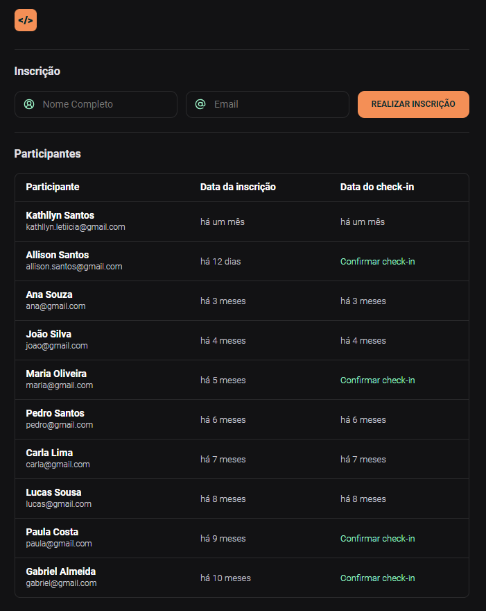

## 👨‍💻 Olá!👋🏼  Bem vindo ao Projeto NLW Unite Sistema de Check-in

Sejam todos bem-vindos a mais um repositório! Desta vez, tive o prazer de participar da criação de um sistema de check-in durante a **NLW Unite**, um evento promovido pela **Rocketseat**.

## Sobre o Projeto

O sistema de check-in foi desenvolvido utilizando as tecnologias clássicas da web: HTML, CSS e JavaScript. Durante o processo de construção, pude aprofundar meus conhecimentos em:

- Utilização de funções em JavaScript para a lógica do sistema.
- Implementação de condicionais para diferentes fluxos de interação.
- Atualização dinâmica de inscrições e informações dos participantes.
- Adição de novos participantes de forma interativa.
- Funcionalidade completa de check-in para todos os participantes.

  

  

## Funcionalidades

- **Atualização de Inscrição:** Os participantes podem atualizar suas informações de inscrição de forma simples e rápida.
- **Adição de Novos Participantes:** Uma funcionalidade que permite a inclusão fácil de novos membros ao evento.
- **Check-in de Participantes:** A principal funcionalidade do sistema, tornando o processo de registro e presença dos participantes ágil e eficiente.

## Estilização Personalizada

Além das funcionalidades, também me dediquei a criar uma interface agradável e intuitiva para os usuários. A estilização foi feita com muito cuidado utilizando CSS, garantindo uma experiência visualmente atraente.

## 🚀 Tecnologias

Esse projeto foi desenvolvido com as seguintes tecnologias:

